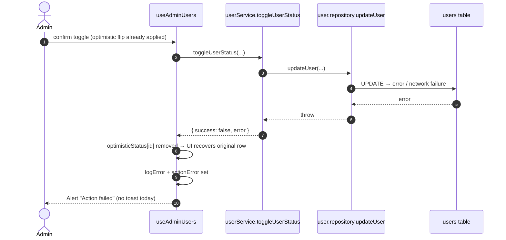

# ADMIN USERS — UX REFINEMENT PLAN (Phase 3.6C, Parts 5–6)

**Date:** 2026-08-03 · **Status:** ⏸ AWAITING APPROVAL — **no implementation begins until this plan and
the three audits are approved.** Structural refinements only; no redesign.

---

# Part 5 — Business Logic Diagram (as built, verified)

## Deactivate / Activate — sequence

```mermaid
sequenceDiagram
    autonumber
    actor Admin
    participant Row as CollectionCard (row)
    participant Btn as Button (xs, danger/success)
    participant Modal as ConfirmModal
    participant Hook as useAdminUsers
    participant Svc as userService.toggleUserStatus
    participant Repo as user.repository.updateUser
    participant Supa as Supabase Client
    participant RLS as RLS (rls_users_admin_all)
    participant DB as users table
    participant Toast as ToastContainer

    Admin->>Btn: click Deactivate
    Btn->>Hook: handleToggleRequest(id, currentStatus)
    Hook->>Hook: setConfirmToggle({id, currentStatus})
    Hook-->>Modal: open (danger)
    Modal-->>Admin: title + message (no name today)
    Admin->>Modal: click Confirm
    Modal->>Hook: handleConfirmToggle()
    Hook->>Hook: optimisticStatus[id] = !currentStatus  (UI flips)
    Hook->>Hook: setConfirmToggle(null)
    Hook->>Svc: toggleUserStatus({user, requestId}, id, newStatus)
    Svc->>Svc: ensureRole(['admin'])  — throws UNAUTHORIZED_ACCESS if not admin
    Svc->>Repo: updateUser(id, { is_active: newStatus })
    Repo->>Supa: UPDATE users SET is_active=… WHERE id=…
    Supa->>RLS: is_admin() check
    RLS-->>Supa: allow (admin)
    Supa->>DB: row updated (soft-disable; NOT a DELETE)
    DB-->>Supa: ok
    Supa-->>Repo: ok
    Repo-->>Svc: ok
    Svc-->>Hook: { success: true }
    Hook->>Hook: actionError=null
    Hook->>Toast: showSuccess("User activated/deactivated successfully")
    Hook->>Hook: fetchData() → re-sync rows
    Hook-->>Row: server truth rendered (Activate/Deactivate flips)
```

## Failure path



## Roles / protection map

| Layer | Allows deactivate | Blocks |
|---|---|---|
| Route (`AuthGuard`+`RoleGuard`) | `role='admin'` only | sub_admin, user, anonymous |
| Service (`ensureRole`) | `role='admin'` only | others → `UNAUTHORIZED_ACCESS` |
| RLS `rls_users_admin_all` | admin on any `users` row | non-admin writes; sub-admin writes |
| DB trigger `prevent_user_role_escalation` | — | non-admin `role`/`educator_id` change |
| RLS `rls_users_self_update` | — | own-row `role`/`educator_id` change (**NOT `is_active`** → SEC-2) |
| **Missing** | — | self/other-admin deactivate (SEC-1), last-admin lockout (SEC-3) |

---

# Part 6 — UX Refinement Plan (pending approval)

Everything below is **backed by the audits**; every change is structural/presentational refinement
within the Management Page Standard — no redesign, no new Foundation component (one additive
Foundation refinement is proposed and flagged).

## 6.1 Selection (Part 1 decision) — REMOVE

- Remove per-row `SelectionCheckbox`, select-all, `selectedIds`/`setSelectedIds`, `allOnPageSelected`/
  `toggleSelectAll`. Keep the "Showing X–Y of Z" range.
- **Foundation refinement (approval):** `CollectionHeader` select-all becomes optional
  (`onToggleSelectAll?: () => void`; range-only render when absent). Questions unchanged.
- Certification impact: supersedes 3.6B delta **D-8** (documented).

## 6.2 Metadata (Part 2 proposal) — STRUCTURED 3-COLUMN

- Replace inline badge+text metadata with labelled equal-width columns: **EXAM / ATTEMPTS / JOINED**,
  `flex gap-6` (24px) columns `flex-1 min-w-0`, label = certified micro-label (`text-text-muted`),
  values = certified `AdminText` (exam keeps certified `Badge`). `truncate` on values. Same structure on
  every row at every breakpoint. Structural classes only.

## 6.3 Deactivate confirm (findings C-1, C-2, C-3) — SAFETY

- Show **who** is being acted on: `"Deactivate <name> (<email>)?"`.
- Add **consequence copy**: e.g. "This user will lose access and must be re-activated by an admin. Their
  data is not deleted."
- Destructive emphasis retained (`danger` confirm). On open, focus the **Cancel** button (safe default).

## 6.4 In-flight state (findings A-1, A-2, H-2) — INTEGRITY

- Hook: add `togglingId: string | null` (set before the request, cleared after settle).
- Row `Button`: `loading` + `disabled` while `togglingId === u.id`.
- `ConfirmModal` confirm `Button`: `loading` while in flight + re-entry ref lock (prevents the same-tick
  double confirm).

## 6.5 Error surfacing (finding H-1) — PARITY

- On toggle failure: keep the `Alert` **and** emit an error toast (parity with success toast). Copy stays
  user-safe.

## 6.6 Service hardening (findings S-1, S-2, R-1) — DEFENSE IN DEPTH

- `toggleUserStatus`: validate target exists and `role='user'`; **reject** self-target and any
  admin/sub-admin target (surfaces `ACTION_FORBIDDEN`); log success with `requestId` + target;
  treat 0 affected rows as failure.
- (No new endpoint — single-target toggle remains the only mutation.)

## 6.7 Database/RLS hardening (findings SEC-1, SEC-2, SEC-3) — DEFENSE IN DEPTH

- `rls_users_self_update`: add `AND is_active = (SELECT is_active FROM public.users WHERE id = auth.uid())`
  to the `WITH CHECK` — a banned user cannot self-reactivate (SEC-2).
- Extend `prevent_user_role_escalation` (or a new BEFORE UPDATE trigger) to forbid **non-admin**
  `is_active` changes (covers SEC-2 at the trigger layer too).
- Service guard covers SEC-1 (admin cannot target self/other admin). Optional: trigger guard preventing
  deactivating the last active admin (SEC-3) — decision requested, as it changes platform-lockout policy.
- All SQL behind a new migration + a regression test entry in the security regression suite.

## 6.8 Accessibility & layout verification (Part 6 base)

- Spacing remains on the 24/12/8 ladder; no page-owned visuals; grep zero visual utilities on page-owned
  nodes; `truncate`/`sr-only`/`aria-*`/`gap-*`/`animate-in` only.
- Row action label already text ("Deactivate"/"Activate"); confirm gets name+email for identification.
- Final gate: `tsc -b` 0 · `build` 0 · lint frozen **405 (352E/53W)**, zero new · page grep zero
  page-owned visuals.

---

# 6.9 Proposed change set (ONLY after approval)

| Area | File(s) | Kind |
|---|---|---|
| Selection removal | `UsersTable.tsx`, `useAdminUsers.ts`, `AdminUsers.tsx` | page composition |
| `CollectionHeader` optional select-all | `src/components/common/CollectionHeader.tsx` | **Foundation additive refinement** |
| Structured metadata | `UsersTable.tsx` | page composition |
| Confirm safety (name, copy, focus) | `AdminUsers.tsx` (ConfirmModal props) | page composition |
| In-flight state | `useAdminUsers.ts`, `UsersTable.tsx`, `AdminUsers.tsx` | hook + composition |
| Error toast parity | `useAdminUsers.ts` | hook |
| Service hardening | `src/services/userService.ts` | service |
| RLS/trigger hardening | `supabase/migrations/<new>.sql` + regression tests | database |

## Approval gate — requested decisions

1. **Approve** removal of selection (supersedes D-8) + optional `CollectionHeader` select-all.
2. **Approve** structured 3-column metadata (EXAM/ATTEMPTS/JOINED).
3. **Approve** the 3.6C deactivate/activate hardening set (confirm safety, in-flight, error toast,
   service guard).
4. **Approve** the RLS/trigger hardening migration, incl. the SEC-3 last-admin guard (or defer).
5. No code is written until (1)–(4) are approved.
